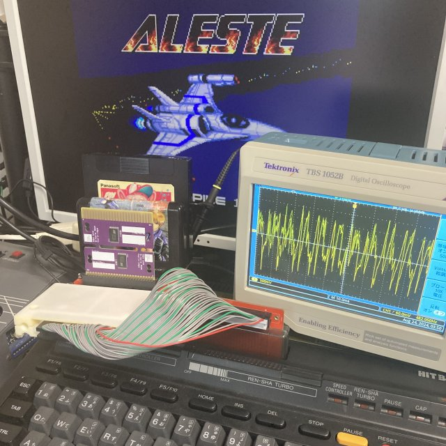

# MSX FM-PAC Enabler  
  

MSX MUSICは、規格にて内蔵音源を持っている場合、外付け音源カセットのFM-PACはDisableする仕様になっています。  

MSX Datapackより

    MSX-MUSICはオプション機能ですから、カートリッジを外付けすることにより、後からFM音源を追加することができます。しかし、MSX-MUSICを内蔵したシステムにFM音源カートリッジを外付けすると、ひとつのシステムに同一アドレスのFM音源LSIが2つ存在することになり、音量が通常の2倍の大きさになってしまいます。
    　これを避けるために、外付けのカートリッジに内蔵されるソフトウェアは、そのカートリッジ内の音源LSIの動作を許可するかどうかを4018Hからの「APRLOPLL」文字列の存在の有無を調べ、文字列がなければカートリッジのFM音源をI/Oポートに接続します。

近年音源を外付けすることで高音質化するハードがいくつかリリースされていますが、当該仕様によりFM-PACが利用できないケースが出てきました。  
本ソフトは、MSX MUSICをつかうゲームソフトなどが立ち上がる前に実行することにより、強制的に外部音源を有効化する事ができます。

## ■ 使い方  
"FMPACEN.ROM"(バイナリー形式)/"FMPACEN.HEX"(Intel HEX形式)が実行ファイルです。  
MSX Simple CartridgeのようなMSXカセットにデータを書き込んでください。  
[参考：MSX Simple Cartridge](https://github.com/v9938/MSX_SimpleCartridge)  

書き込みアドレスは0x4000～になります。  

書き込んだROMカセットをスロットに差し込み電源を入れることで実行されます。  
有効化したい対象ソフトがROMカセットの場合、必ずスロット番号の若い方に本カセットを挿入してください。  

## ■ おまけ機能  

MSXTurboRでは[2]キーを押す事で非対応ソフトをR800高速モードで起動させることが可能です。  

## ■ ソースコードの説明

"OPLL"の文字列を持っているスロットを探し、内蔵音源以外だった場合は07ff6h bit0に1を書き込む事で外付けOPLLを有効化します。  
なお、ソフトのコンパイルにはマイクロソフト社のM80を使っています。  
下記のオプションでコンパイルしてください。CP/Mエミュレータを併用すると色々ハッピーです。     

	M80 =FMPACEN
	l80 /p:4000,fmpacen,fmpacen/n/x/e

## ■ 頒布について   

MITライセンスですのライセンスの範疇で適当にどうぞ。  
可能であれば下記製品を使ってくれると嬉しいです。    

### 家電のKENちゃん  

●MSX用カートリッジ64K Simple ROM Cartridge 【SOP版 完成品】  
<https://www.kadenken.com/view/item/000000001288>  
